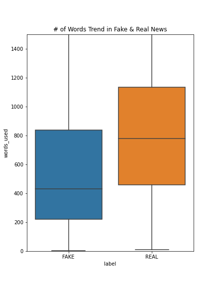
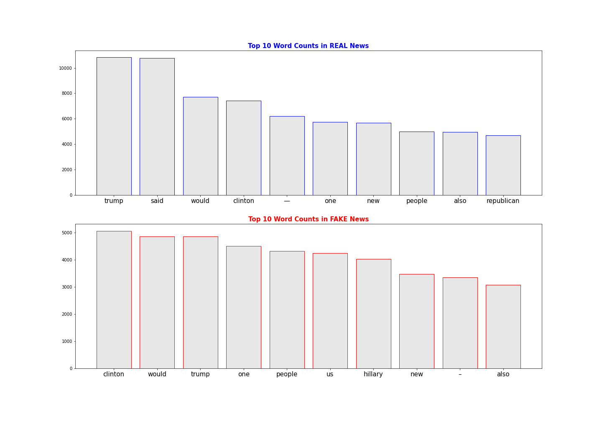
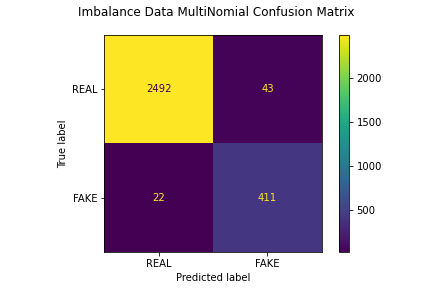
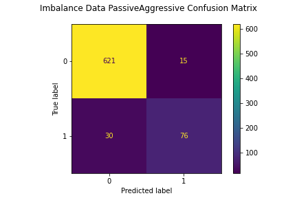
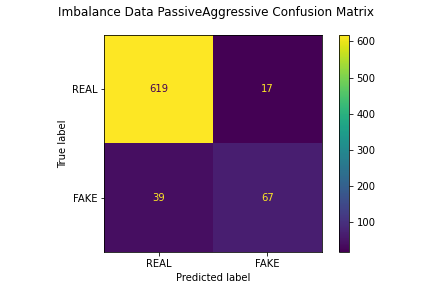

# Fake News Detction Model
**Author**: [Ji Hoon Chung](mailto:jhj1650@gmail.com)

## Business Problem

We are living in an unprecedented era where we are easily being exposed to tons of news on social media which we did not intend to spot. From premature juveniles to mature adults with higher degrees of education, fake news could easily deprive their factual senses and having them fallen down to imperfect beliefs.

Accordingly, it is crucial for social media platforms to detect fake news automatically to prohibit their exposure in the first place.

Our clients are Social Media Platforms like Facebook, Twitter, and LinkedIn. I would like to introduce a machine learning model being able to classify fake news aside from actual news using the words and patterns that are prevalent in conventional news dataset.

To define Fake News, "fake news is a type of yellow journalism or propaganda that consists of deliberate misinformation or hoaxes spread via traditional print and broadcast news media or online social media
Source = https://library.gannon.edu/c.php?g=728528&p=5206339

We'll be dealing with Natural Language Processing technique to fully dive into bulding our classification model.

The Python programing language provides a wide range of tools and libraries for attacking specific NLP tasks. Many of these are found in the Natural Language Toolkit, or NLTK, an open source collection of libraries, programs, and education resources for building NLP programs.

The NLTK includes libraries for many of the NLP tasks listed above, plus libraries for subtasks, such as sentence parsing, word segmentation, stemming and lemmatization (methods of trimming words down to their roots), and tokenization (for breaking phrases, sentences, paragraphs and passages into tokens that help the computer better understand the text). It also includes libraries for implementing capabilities such as semantic reasoning, the ability to reach logical conclusions based on facts extracted from text.

Source = https://www.ibm.com/cloud/learn/natural-language-processing

## Overview

Dataset is obtained from source: https://drive.google.com/file/d/1er9NJTLUA3qnRuyhfzuN0XUsoIC4a-_q/view

I’ve collected a dataset which includes 6,335 rows of data containing 3,171 real news vs 3,164 fake news. Dataset will be resampled with 0.17:1.0 FAKE to REAL news ratio. (Real World Fake to Real news ratio). Dataset is very straight forward containing only 3 columns such as, title, text (article contents), and label indicating real or fake.

Text Dataset will be broken into 3 categories for further investigation:

Original Text Data
Lemmatized Text Data
Stemmed Text Data
Text dataset will be trained after they are transformed into either one of the two vectorizers:

TFIDFVectorizer.
CounterVectorizer.

These vectorizers will convert text into form of matrices and we'll be able to perform classification model training.
For the evaluation, both the precision & recall score would be important, but I would weigh more in the precision score as true positive rate should maintain high enough to have credibility in our model's FAKE news detection accuracy. For the Cross Valdiation, we will evaluate metric for the F1 score as balance begtween precision & recall is still very important

## EDA
1. For original Text, Title and text were combined for the Analysis.
2. Stemming & Lemmatization Methods were also brought in to change form of the words. Stemming and Lemmatization basically changes the form of words back to most basic root. (Ex. is, am, are, --> be)

3. It is shown that REAL news generally have quite longer length than the FAKE news.


4. It is hard to distinguish FAKE vs REAL news from the wordcloud so Top 10 Word Frequency was plotted for both FAKE and REAL news. Plese see below:


According to the Plot, there are a few notable differences between REAL & FAKE NEWS:

Trump was much widely used in REAL news whereas Clinton was more widely used in FAKE News.
It looks like FAKE news was more susceptible in using Full Name of Hilary Clinton.
'US' was very widely used in FAKE news wheareas it was not one of the TOP 10 words in REAL news.

## Modeling
***
5 Models were built using 5 classifiers below:
1. DummyClassifier Model (Used for baseline to see minimum performance of the model)
2. DecisionTree Classifier Model
3. RandomForest Classifier Model
4. MultinomialNB Classifier Model
5. PassiveAggressive Classifier Model

Out of all the models, MultinomialNB Classifier Model and PassiveAggressive Classifier model were the 2 best models.
For both models, ConfusionMatrix was created after testing with the training set.



MultinomialNB Classifier was built after TFIDF Vectorization using the Lemmatized Text.



PassiveAggressive Classifier was built after TFIDF Vectorization using the Lemmatized Text.


## Conclusion

From the Cross Validation F-1 Score, PassiveAggressive classification model is chosen to be the best perfomring model. For the Final Model, following parameters were chosen to build up the best model:

TfIDF Vectorizer was used with stop_words in'english'. (Max_df=0.7)
PassiveAggressive Classification model was used.
Lemmatized Text was used for training and evaluation.
For the training, class balance was maintained at 0.17:1.0 class ratio.
For the final model testing with the Test Set:

Precision (True Positive Rate) = 0.80
Recall (Proportion of FAKE news classified correctly) = 0.63
F-1 Score = 0.71



## Ideas for Improvement
1. Try Unsupervised Learning Models. (Deep Learning)
2. Try Web-Scraping from Fake News sites like Onions and see how well our model performs.
3. Try Web-Scraping from Social Media and see the Fake News Detection Rate.

## Repository Structure

***
```
├── README.md                           <- The high-level overview of this project
├── Detecting Fake News.pdf             <- PDF version of project presentation
├── Fake_News_Notebook_Final.ipynb      <- Final_Notebook used for the project
├── images                              <- Sourced externally and visualizations generated from code
├── data                                <- All the .csv data files used for the notebook.
```
